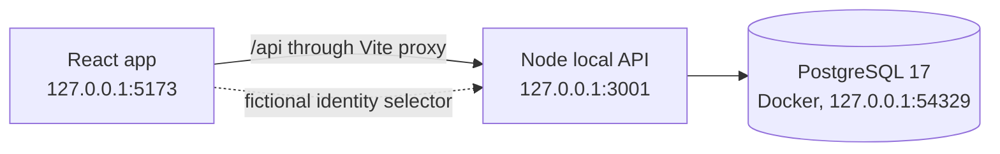
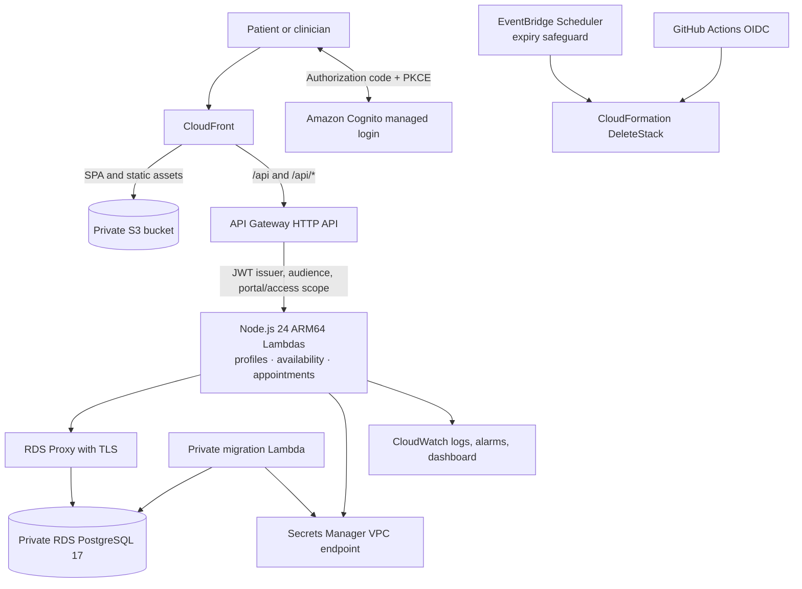

# Appointment Portal

A full-stack TypeScript portfolio project for a fictional patient and clinician
appointment workflow. Patients can browse clinicians, book an available 30-minute
slot, cancel an appointment, and view their history. Clinicians can publish or
withdraw availability and manage their appointments.

The repository demonstrates the application locally with real PostgreSQL and an
AWS design built with CDK. Local behavior is fully testable without an AWS account.
The AWS deployment path is implemented, but its live end-to-end verification is
unfinished; see [AWS deployment status](#aws-deployment-status).

## Technology stack

| Area | Technologies |
| --- | --- |
| Frontend | React 19, TypeScript, Vite, React Router, TanStack Query, React Hook Form, Zod, Tailwind CSS, Radix UI |
| Backend | Node.js 24, TypeScript, REST handlers, `pg`, Zod |
| Data | PostgreSQL 17, SQL migrations, transaction and database constraints for booking races |
| Local development | Docker Compose for PostgreSQL, local Node API adapter, Vite proxy |
| Testing | Vitest, Testing Library, Playwright, axe, Lighthouse, real PostgreSQL integration tests |
| AWS design | CDK, CloudFront, private S3, API Gateway HTTP API, Lambda, Cognito, RDS PostgreSQL, RDS Proxy, Secrets Manager, CloudWatch, EventBridge Scheduler |
| Delivery | GitHub Actions and GitHub OIDC to AWS |

The application uses shared Zod contracts at its HTTP boundary. Authorization is
also enforced in backend services: a request cannot select another patient's or
clinician's identity by changing its body. PostgreSQL provides the final booking
race guarantee with a partial unique index allowing only one active appointment
per slot.

## How it works locally

Local development keeps the same React pages, REST routes, services, repositories,
migrations, and PostgreSQL constraints as the AWS design. Docker runs only the
database. The API and frontend run as Node processes on the host:



The local identity selector replaces Cognito only in development. It sends an
`X-Local-Actor` header to a loopback-only adapter, which refuses to start unless
`PORTAL_LOCAL_AUTH=1` and `NODE_ENV` is not `production`. Local authentication code
is excluded from production artifacts.

### Prerequisites

- Node.js **24.0.1** (`.nvmrc` is included)
- pnpm **11.22.0**, invoked below through Corepack
- Docker with Docker Compose

### Quick start with Docker

Clone the repository, install dependencies, build the shared contracts, start
PostgreSQL, and prepare the demo data:

```sh
git clone https://github.com/bxljoy/appointment-portal.git
cd appointment-portal
nvm use
corepack pnpm@11.22.0 install --frozen-lockfile --ignore-scripts
corepack pnpm@11.22.0 --filter @portal/contracts build

set -a
. ./.env.example
set +a

docker compose up -d --wait postgres
corepack pnpm@11.22.0 --filter @portal/database migrate
corepack pnpm@11.22.0 --filter @portal/database seed
```

Start the API in that terminal:

```sh
PORTAL_LOCAL_AUTH=1 NODE_ENV=development corepack pnpm@11.22.0 --filter @portal/api dev:local
```

In a second terminal, start the frontend:

```sh
nvm use
corepack pnpm@11.22.0 --filter @portal/web dev
```

Open [http://127.0.0.1:5173](http://127.0.0.1:5173), choose an identity, and select
**Sign in**. You can also check the API directly:

```sh
curl -i http://127.0.0.1:3001/api/me -H 'X-Local-Actor: patient-a'
```

The seeded fictional identities are:

| Local actor | Display name | Role |
| --- | --- | --- |
| `patient-a` | Alice Patient | Patient |
| `patient-b` | Bea Patient | Patient |
| `clinician-a` | Casey Clinician | Clinician |
| `clinician-b` | Devon Clinician | Clinician |

The fixed local ports are PostgreSQL `54329`, API `3001`, and Vite `5173`. Vite
requires `5173` to be free. Re-running the seed at a different time can add more
demo slots; use a fresh database when you want a complete reset.

Stop the frontend and API with Ctrl-C. Use `down` to keep the database volume for
another session, or add `--volumes` for a complete reset:

```sh
docker compose down --volumes
```

See the [local development runbook](docs/runbook/local.md) for configuration details.

## Testing locally

The test suite covers several different boundaries:

- service, repository, SQL migration, provisioning, and REST adapter behavior;
- React components, routing, authentication lifecycle, forms, and API parsing;
- CDK assertions and real offline synthesis for both deployment phases;
- bundle and deployable-artifact checks, including guards against local auth and
  credential material entering production output;
- Playwright journeys at desktop and mobile sizes against real HTTP processes and
  PostgreSQL, including two-patient booking races and automated accessibility checks;
- Lighthouse runner behavior and privacy controls around managed-login tests.

Start PostgreSQL and install Chromium before the complete checks:

```sh
nvm use
corepack pnpm@11.22.0 install --frozen-lockfile --ignore-scripts
docker compose up -d --wait postgres
corepack pnpm@11.22.0 --filter @portal/contracts build
corepack pnpm@11.22.0 exec playwright install chromium
```

Then run the quality gates in this order. Playwright runs last because it manages
the ignored `test-results/` directory used by some privacy regression fixtures.

```sh
corepack pnpm@11.22.0 lint
corepack pnpm@11.22.0 typecheck
corepack pnpm@11.22.0 test
corepack pnpm@11.22.0 build
corepack pnpm@11.22.0 --filter @portal/api build:lambdas
corepack pnpm@11.22.0 check:infra
corepack pnpm@11.22.0 check:bundles
corepack pnpm@11.22.0 check:artifacts
corepack pnpm@11.22.0 audit --audit-level=high
corepack pnpm@11.22.0 test:e2e
```

`check:infra` synthesizes the bootstrap and ready CDK assemblies offline with a
fictional account; it does not contact AWS. `test:e2e` runs the `local-desktop` and
`local-mobile` Playwright projects. Each worker creates an isolated temporary
database and starts its own API and Vite processes. No API routes are mocked.

At the final local verification on 2026-09-08, all quality gates passed, including
705 Vitest tests and 16 Playwright desktop/mobile tests. These results do not claim
that the opt-in AWS Playwright projects passed. See the [testing
runbook](docs/runbook/testing.md) for the scenarios and test isolation rules.

## Repository structure

```text
apps/web/              React application and browser-side authentication
apps/api/              REST routes, services, repositories, Lambda handlers, local adapter
packages/contracts/    Shared request and response schemas and TypeScript types
packages/database/     PostgreSQL migrations, local seed, and AWS migration handler
infra/                 AWS CDK application, constructs, and infrastructure tests
scripts/               Deployment, verification, diagnostics, and cleanup tooling
tests/e2e/             Local and opt-in AWS Playwright journeys
docs/                   Architecture notes, runbooks, and evidence status
.github/workflows/      Local quality, disposable deployment, and destroy workflows
```

## Possible AWS solution

The CDK application models this deployment:



CloudFront provides one HTTPS origin to the browser. It reads the SPA from a private
S3 bucket through origin access control and forwards same-origin `/api` requests to
API Gateway with caching disabled. API Gateway validates Cognito access tokens
before invoking three feature Lambdas.

The Lambdas run in two private isolated subnets without NAT or an internet gateway.
They reach PostgreSQL through RDS Proxy and read the least-privilege application
credential through a private Secrets Manager endpoint. A separate migration Lambda
can reach RDS directly with the administrator credential. CloudWatch supplies bounded
logs, alarms, and a dashboard. A one-time Scheduler target provides a backstop to
delete the disposable application stack at its expiry.

The deployment is deliberately two-pass because the final CloudFront URL does not
exist before the first deployment:

1. **Bootstrap:** create Cognito, networking, database, proxy, API, and frontend
   resources. The proxy temporarily uses the administrator secret.
2. **Provision:** invoke the private migration function, create the constrained
   `portal_app` database role, and create fictional Cognito test users.
3. **Ready:** update Cognito callback URLs with the literal CloudFront origin, switch
   RDS Proxy to `portal_app`, publish the SPA and public `config.json`, invalidate
   CloudFront, and run deployed verification.

For the complete resource and security decisions, see the [AWS architecture
document](docs/architecture/deployment.md), [identity runbook](docs/runbook/identity.md),
and [database provisioning runbook](docs/runbook/provisioning.md).

## AWS deployment status

The AWS implementation has extensive unit, synthesis, bundle, artifact, workflow,
and cleanup coverage, but it is **not live-verified**. Disposable deployment attempts
were made in `eu-north-1` and rolled back. In the final attempt, the PostgreSQL
instance was created, but `AWS::RDS::DBProxy` creation failed during bootstrap just
after AWS created the account's `AWSServiceRoleForRDS` service-linked role. This was
a first-use IAM propagation race; CloudFormation then cancelled other in-progress
resources and rolled back the stack. The application stack and project-owned
deployment resources were subsequently destroyed and cleanup was verified. The
AWS-managed service-linked role may remain; an IAM role alone has no hourly or
monthly charge.

Because testing stopped after cleanup, a later deployment was not run to prove that
the now-existing service-linked role resolves the race. The following also remain
unverified in a live environment:

- completion of the bootstrap, provision, and ready phases;
- Cognito self-registration, email verification, login, logout, token expiry, and
  password recovery;
- real API authorization, concurrent booking, CloudFront/S3 behavior, and throttling;
- live CloudWatch correlation and public/authenticated Lighthouse measurements.

The public evidence files intentionally retain [AWS verification: not
executed](docs/evidence/verification.md) and [performance: not
measured](docs/evidence/performance.md). Passing offline CDK synthesis is not presented
as a successful deployment.

## Resuming the disposable AWS demo

Treat the AWS configuration as a short-lived learning environment, not a production
system. Before resuming, use an AWS account and region you control, configure the AWS
and GitHub CLIs, choose four controlled email addresses, obtain current prices, set a
strict cost ceiling and lifetime of at most six hours, and rerun every local quality
gate.

Follow the [deployment runbook](docs/runbook/deploy.md) rather than invoking CDK by
hand. It explains the private `.runtime` inputs, preflight checks, project-specific
CDK bootstrap, immutable GitHub OIDC identity, GitHub `demo` environment, two-pass
deployment, manual Cognito check, automated verification, and performance commands.
The main lifecycle commands used by that process are:

```sh
corepack pnpm@11.22.0 demo:preflight
corepack pnpm@11.22.0 demo:setup-delivery
corepack pnpm@11.22.0 demo:deploy
corepack pnpm@11.22.0 demo:confirm-registration
corepack pnpm@11.22.0 demo:verify
corepack pnpm@11.22.0 demo:measure -- "https://DEPLOYED-CLOUDFRONT/" public
PORTAL_LIGHTHOUSE_CREDENTIAL_FILE=.runtime/credentials/PATIENT_FILE corepack pnpm@11.22.0 demo:measure -- "https://DEPLOYED-CLOUDFRONT/appointments" authenticated
```

These commands require fresh, private configuration files and authorized AWS/GitHub
credentials; they are not a copy-and-paste deployment shortcut. Prefer the manual
**Disposable AWS demo** GitHub Actions workflow once its environment is configured,
because it runs the complete ordered lifecycle and attempts application cleanup on
an ordinary job failure. A successful run stays live for the manual registration and
performance checks, so destroy it explicitly when verification is complete. A lost
runner may skip failure cleanup; restore its uploaded inventory and follow the destroy
runbook locally.

Before deletion, review the exact inventory with a dry run, then destroy the
application plus project-exclusive delivery and toolkit resources and verify that
nothing billable remains. Preserve `.runtime/deployment.json` and run the `--all`
steps locally with the selected AWS profile:

```sh
corepack pnpm@11.22.0 demo:destroy -- --dry-run --all
corepack pnpm@11.22.0 demo:destroy -- --all --force-disposable-secrets
corepack pnpm@11.22.0 demo:verify-cleanup -- --all
```

The expiry schedule is only a backstop: it deletes the application stack, but it
cannot prove that retained resources disappeared or remove the delivery/toolkit
stacks. Follow the [destroy and cleanup runbook](docs/runbook/destroy.md), especially
after a failed or cancelled runner.

## Safety boundaries

- The project contains only fictional patient and clinician data. Do not use real
  patient information or treat it as a production health system.
- `.runtime/`, credentials, browser storage, traces, reports, and `test-results/`
  are ignored. Do not commit or upload them.
- Production artifacts reject local authentication markers and known credential
  sentinels.
- The RDS database, secrets, buckets, logs, and stacks use destructive removal
  policies for a disposable demo. This lifecycle is inappropriate for production.
- AWS preflight estimates cost but does not create an AWS Budget or hard billing cap.
  Verify cleanup and review account billing after every deployment attempt.
